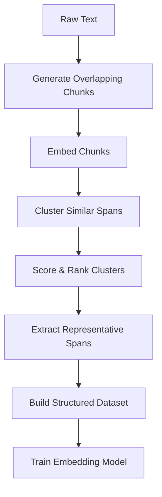

# Emerge 🌱

## What is Emerge?

**Emerge** is an intelligent text curation framework that discovers, extracts, and organizes semantically meaningful content from unstructured text. Like a careful gardener that knows exactly which seedlings to nurture, Emerge identifies and cultivates the most valuable insights from your text data.

> *The name "Emerge" refers to how meaningful patterns and themes naturally emerge from raw text through our curation process.*

## 🌟 Why Emerge Exists

Training effective embedding models requires high-quality, semantically annotated datasets, but manually creating these is prohibitively expensive and time-consuming. Emerge solves this by:

1. **Automating semantic chunking** - Identifying natural semantic boundaries in text
2. **Discovering emergent themes** - Finding related concepts across your corpus
3. **Creating structured relevance judgments** - Generating labeled datasets for model training
4. **Preserving context** - Maintaining the relationship between chunks and their sources

The result is a semantically rich dataset that's perfect for training or fine-tuning embedding models that understand relevance at a deeper level.

## 🚀 Key Features

- **Pareto-optimal span prediction** - Identifies the most informative text spans using multi-objective optimization
- **Context-aware clustering** - Groups semantically similar chunks while preserving their context
- **Quality metrics** - Comprehensive measurement of content quality and cluster coherence
- **Interactive visualization** - Explore and understand your content with intuitive highlighting
- **Flexible processing pipeline** - Works with various embedding models and content types

## 🧩 How It Works


### The Curation Pipeline



1. **Chunk Generation**: Create variable-length, overlapping text spans that capture complete thoughts
2. **Embedding**: Convert chunks to vector representations using pre-trained models
3. **Clustering**: Group similar spans into topical clusters using UMAP+HDBSCAN
4. **Optimization**: Use Pareto optimization to identify the most informative spans
5. **Dataset Creation**: Structure the data with cluster assignments and relevance scores
6. **Quality Assessment**: Compute coherence and coverage metrics for validation

## 🔍 Example

Given a conversation about quarterly business performance:

```
Customer: How did we perform in Q3 overall?
Rep: Our Q3 results were strong. Revenue grew by 15% year-over-year, 
     and we exceeded our target profit margin by 2.3 percentage points. 
     The new product line contributed significantly, accounting for 
     about 30% of our growth this quarter.
```

Emerge identifies relevant semantic chunks and their clusters:

| Chunk | Cluster ID | Cluster Title | Relevance |
|-------|------------|---------------|-----------|
| "Revenue grew by 15% year-over-year" | 2451 | Financial Performance Metrics | 0.95 |
| "exceeded our target profit margin by 2.3 percentage points" | 2451 | Financial Performance Metrics | 0.87 |
| "new product line contributed significantly" | 3782 | Product Performance | 0.82 |
| "accounting for about 30% of our growth" | 2451 | Financial Performance Metrics | 0.79 |

This structured output can then be used to train embedding models that better understand the semantic relationships between concepts like "revenue growth", "profit margins", and "product performance".

## 🛠️ Components

### Curator

The orchestrator of the entire process, managing the flow of data through the pipeline.

```python
curator = Curator(
    model=model,
    tokenizer=tokenizer,
    config=config,
    analyzer=analyzer
)

# Process a batch of texts
dataset = curator.process_batch(texts)

# Compute quality metrics
dataset_with_metrics = curator.compute_quality_metrics(dataset)

# Prepare final dataset
final_dataset = curator.prepare_final_dataset(dataset_with_metrics)
```

### ClusterAnalyzer

Identifies meaningful spans in text and assigns them to semantic clusters.

```python
analyzer = LocalClusterAnalyzer(
    pipeline=pipeline,
    config=AnalyzerConfig(min_len=5, max_len=50),
    model=model,
    tokenizer=tokenizer
)

# Analyze text spans
result, clusters, metrics, scores = analyzer.predict(
    text, 
    min_len=10, 
    max_len=100,
    stride=1
)
```

### ClusteringPipeline

The underlying engine that performs dimensionality reduction and clustering.

```python
pipeline = ClusteringPipeline(config=ClusteringConfig(
    embedding_dims=768,
    umap_n_components=[50],
    min_cluster_sizes=[10, 15]
))

# Train the clustering model
labels, evaluation = pipeline.fit_transform(embeddings)
```

## 🧪 Getting Started

### Installation

```bash
# Clone the repository
git clone https://github.com/yourusername/emerge.git
cd emerge

# Install dependencies
pip install -r requirements.txt
```

### Quick Start

```python
from emerge.src.curation.curator import Curator, CuratorConfig
from emerge.src.curation.analyzers.local_cluster_analyzer import LocalClusterAnalyzer
from emerge.src.embedding.clustering import ClusteringPipeline

# Load your pre-trained clustering pipeline
pipeline = ClusteringPipeline.load("artifacts/clustering/models")

# Initialize analyzer
analyzer = LocalClusterAnalyzer(
    pipeline=pipeline,
    config=AnalyzerConfig(min_len=5, max_len=50),
    model=model,
    tokenizer=tokenizer
)

# Configure curator
config = CuratorConfig(
    min_length=10,
    max_length=200,
    quality_threshold=0.6
)

# Initialize curator
curator = Curator(model, tokenizer, config, analyzer)

# Process your texts
dataset = curator.process_batch(texts)
final_dataset = curator.prepare_final_dataset(dataset)

# Save the curated dataset
curator.save_dataset(final_dataset, "outputs/curated_datasets/my_dataset")
```

## 🔮 Future Directions

- **Multi-modal support**: Extend to handle images, audio, and video content
- **Interactive labeling**: Add human-in-the-loop capabilities for refinement
- **Cross-lingual clustering**: Improve support for multilingual corpora
- **Real-time processing**: Enable streaming of large-scale text collections
- **Self-improving curation**: Implement feedback mechanisms to improve curation quality over time

## 💖 Contributing

We welcome contributions! See our contributing guide for more information.

## 📜 License

This project is licensed under the MIT License - see the LICENSE file for details.

---
