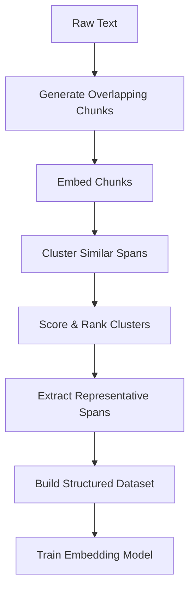

# Emerge

## What is this?
Emerge utilizes fine grained clustering to identify emergent patterns in your text data, uses fine grained prediction to assign discovered as well as any user defined labels to the data, and assigns graded relevance to each point, for curating a high quality labelled dataset ready for fine-tuning embedding models on your data!

Put simply, Emerge uses clustering and prediction over densly sampled text spans, relying on the power of HDBSCAN+UMAP and Pareto optimization over Cluster Quality metrics, to curate high quality, semantically rich datasets from your text data.

Optionally one can provide custom labels or "Topics" to guide the curation process, which Emerge can incorporate in its Late Interaction curator to produce a labelled dataset in the similar, densly sampled, clustered and relevance scored format.

## What it actually does

1. **Chunks your text** - Splits text into overlapping spans of different lengths
2. **Embeds the chunks** - Uses Jina embeddings to convert text chunks to vectors  
3. **Clusters similar chunks** - Groups chunks using UMAP + HDBSCAN clustering
4. **Labels everything** - Assigns cluster IDs and generates cluster titles via OpenAI API
5. **Saves a dataset** - Outputs CSV with chunks and their cluster assignments

Useful if you want to automatically organize and label chunks of text for dataset creation.

## How It Works

### The Curation Pipeline



1. **Chunk Generation**: Create variable-length, overlapping text spans that capture semantics at various granularities 
2. **Embedding**: Convert chunks to vector representations using pre-trained models
3. **Clustering**: Group similar spans into topical clusters using UMAP+HDBSCAN
4. **Optimization**: Use Pareto optimization to identify the most informative spans
5. **Dataset Creation**: Structure the data with cluster assignments and relevance scores
6. **Quality Assessment**: Compute coherence and coverage metrics for validation

## 🔍 Example

Given a conversation about quarterly business performance:

```
Customer: How did we perform in Q3 overall?
Rep: Our Q3 results were strong. Revenue grew by 15% year-over-year, 
     and we exceeded our target profit margin by 2.3 percentage points. 
     The new product line contributed significantly, accounting for 
     about 30% of our growth this quarter.
```

Emerge identifies relevant semantic chunks and their clusters:

| Chunk | Cluster ID | Cluster Title | Relevance |
|-------|------------|---------------|-----------|
| "Revenue grew by 15% year-over-year" | 2451 | Financial Performance Metrics | 0.95 |
| "exceeded our target profit margin by 2.3 percentage points" | 2451 | Financial Performance Metrics | 0.87 |
| "new product line contributed significantly" | 3782 | Product Performance | 0.82 |
| "accounting for about 30% of our growth" | 2451 | Financial Performance Metrics | 0.79 |

This structured output can then be used to train embedding models that better understand the semantic relationships between concepts like "revenue growth", "profit margins", and "product performance".

## 🛠️ Components

### Curator

The orchestrator of the entire process, managing the flow of data through the pipeline.

```python
curator = Curator(
    model=model,
    tokenizer=tokenizer,
    config=config,
    analyzer=analyzer
)

# Process a batch of texts
dataset = curator.process_batch(texts)

# Compute quality metrics
dataset_with_metrics = curator.compute_quality_metrics(dataset)

# Prepare final dataset
final_dataset = curator.prepare_final_dataset(dataset_with_metrics)
```

### ClusterAnalyzer

Identifies meaningful spans in text and assigns them to semantic clusters.

```python
analyzer = LocalClusterAnalyzer(
    pipeline=pipeline,
    config=AnalyzerConfig(min_len=5, max_len=50),
    model=model,
    tokenizer=tokenizer
)

# Analyze text spans
result, clusters, metrics, scores = analyzer.predict(
    text, 
    min_len=10, 
    max_len=100,
    stride=1
)
```

### ClusteringPipeline

The underlying engine that performs dimensionality reduction and clustering.

```python
pipeline = ClusteringPipeline(config=ClusteringConfig(
    embedding_dims=768,
    umap_n_components=[50],
    min_cluster_sizes=[10, 15]
))

# Train the clustering model
labels, evaluation = pipeline.fit_transform(embeddings)
```

### LateInteractionCrossEncoder

A specialized analyzer for topic-based text classification using late interaction techniques with Jina Embeddings v3. This analyzer is ideal when you have predefined topics and want to classify text spans into those categories rather than discovering clusters automatically.

```python
from src.curation.analyzers.late_interaction_cross_encoder_analyzer import LateInteractionCrossEncoder, Topic

# Define your topics with examples
topics = [
    Topic(
        id=1, 
        name="Customer Support", 
        description="Customer support inquiries and questions",
        examples=[
            "I need help with my account",
            "How do I reset my password?",
            "Can you help me with billing issues?"
        ]
    ),
    Topic(
        id=2, 
        name="Product Features", 
        description="Questions about product features and capabilities",
        examples=[
            "What features does your product have?",
            "Does it support mobile devices?",
            "Can I integrate this with my existing tools?"
        ]
    )
]

# Initialize the analyzer
analyzer = LateInteractionCrossEncoder(
    config=AnalyzerConfig(min_len=5, max_len=50),
    topics=topics,
    relevance_threshold=0.5,
    prediction_mode='late_chunking'  # or 'typical'
)

# Analyze text for topic matches
text = "I'm having trouble logging into my account and need assistance"
results, topic_ids, scores, metrics = analyzer.predict(
    sentence=text,
    stride=2,
    min_len=10,
    max_len=100,
    sent_id="sample_1"
)
```

## 🧪 Getting Started

### Installation

```bash
# Clone the repository
git clone https://github.com/yourusername/emerge.git
cd emerge

# Install dependencies
pip install -r requirements.txt
```

### When to Use Which Analyzer

**LocalClusterAnalyzer**: Use when you want to automatically discover hidden topics and patterns in your text data without predefined categories. Best for exploratory data analysis and unsupervised learning scenarios.

**LateInteractionCrossEncoder**: Use when you have specific topics or categories in mind and want to classify text spans accordingly. Perfect for supervised classification tasks where you can provide topic descriptions and examples.

### Quick Start

#### Using LocalClusterAnalyzer (Unsupervised Discovery)

```python
from emerge.src.curation.curator import Curator, CuratorConfig
from emerge.src.curation.analyzers.local_cluster_analyzer import LocalClusterAnalyzer
from emerge.src.embedding.clustering import ClusteringPipeline

# Load your pre-trained clustering pipeline
pipeline = ClusteringPipeline.load("artifacts/clustering/models")

# Initialize analyzer
analyzer = LocalClusterAnalyzer(
    pipeline=pipeline,
    config=AnalyzerConfig(min_len=5, max_len=50),
    model=model,
    tokenizer=tokenizer
)

# Configure curator
config = CuratorConfig(
    min_length=10,
    max_length=200,
    quality_threshold=0.6
)

# Initialize curator
curator = Curator(model, tokenizer, config, analyzer)

# Process your texts
dataset = curator.process_batch(texts)
final_dataset = curator.prepare_final_dataset(dataset)

# Save the curated dataset
curator.save_dataset(final_dataset, "outputs/curated_datasets/my_dataset")
```

#### Using LateInteractionCrossEncoder (Topic Classification)

```python
from emerge.src.curation.curator import Curator, CuratorConfig
from emerge.src.curation.analyzers.late_interaction_cross_encoder_analyzer import LateInteractionCrossEncoder, Topic
from emerge.src.curation.analyzers.base_analyzer import AnalyzerConfig

# Define your business-specific topics
topics = [
    Topic(
        id=1, 
        name="Customer Issues", 
        description="Customer complaints, problems, and support requests",
        examples=[
            "My product stopped working after the update",
            "I can't access my account anymore", 
            "The billing seems incorrect this month"
        ]
    ),
    Topic(
        id=2, 
        name="Feature Requests", 
        description="Requests for new features or product improvements",
        examples=[
            "Could you add dark mode support?",
            "We need better integration with Slack",
            "Mobile app needs offline functionality"
        ]
    ),
    Topic(
        id=3, 
        name="Pricing Inquiries", 
        description="Questions about pricing, plans, and billing",
        examples=[
            "What's included in the premium plan?",
            "Do you offer discounts for nonprofits?",
            "Can I upgrade my subscription mid-cycle?"
        ]
    )
]

# Initialize the late interaction analyzer
analyzer = LateInteractionCrossEncoder(
    config=AnalyzerConfig(min_len=10, max_len=100),
    topics=topics,
    relevance_threshold=0.4,
    prediction_mode='late_chunking'
)

# Configure curator for topic-based classification
config = CuratorConfig(
    min_length=15,
    max_length=150,
    quality_threshold=0.4,
    stride=2
)

# Initialize curator with the late interaction analyzer
curator = Curator(model, tokenizer, config, analyzer)

# Process customer feedback texts
customer_texts = [
    "Hi, I'm really frustrated because the mobile app keeps crashing when I try to sync my data...",
    "Love the product overall! Would be amazing if you could add a feature to export data to CSV format...",
    "I'm interested in upgrading to your enterprise plan but need to know what the pricing looks like..."
]

# Process and get topic-classified dataset
dataset = curator.process_batch(customer_texts)
final_dataset = curator.prepare_final_dataset(dataset)

# Each text span will be labeled with the most relevant topic
# Results include topic assignments, relevance scores, and representative spans
print(f"Processed {len(final_dataset)} topic-labeled spans")
```

#### Key Features of LateInteractionCrossEncoder

- **Efficient Processing**: Uses late interaction techniques similar to ColBERT for fast text-topic matching
- **Flexible Topic Definition**: Supports topics with descriptions and multiple examples
- **Two Processing Modes**: 
  - `late_chunking`: Single embedding pass with token-level matching (more efficient)
  - `typical`: Separate embedding for each text chunk (more flexible)
- **MaxSim Scoring**: Advanced similarity scoring that finds the best token-level matches between text and topics
- **Relevance Thresholding**: Filter out low-confidence matches with configurable thresholds
- **Seamless Integration**: Works with the existing Curator framework and follows the same interface as other analyzers

---
